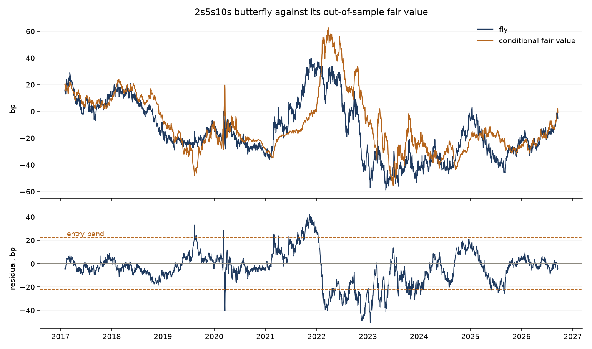
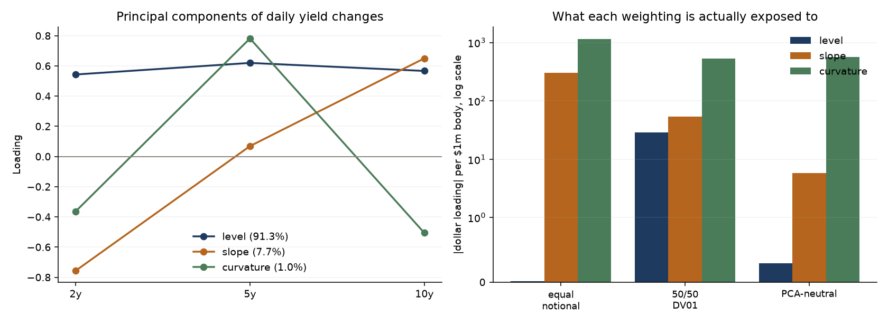
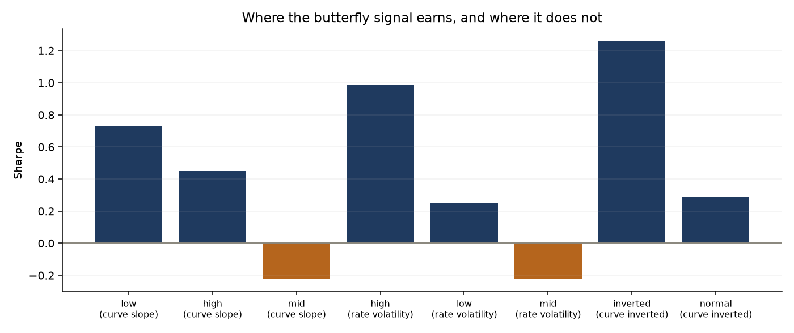
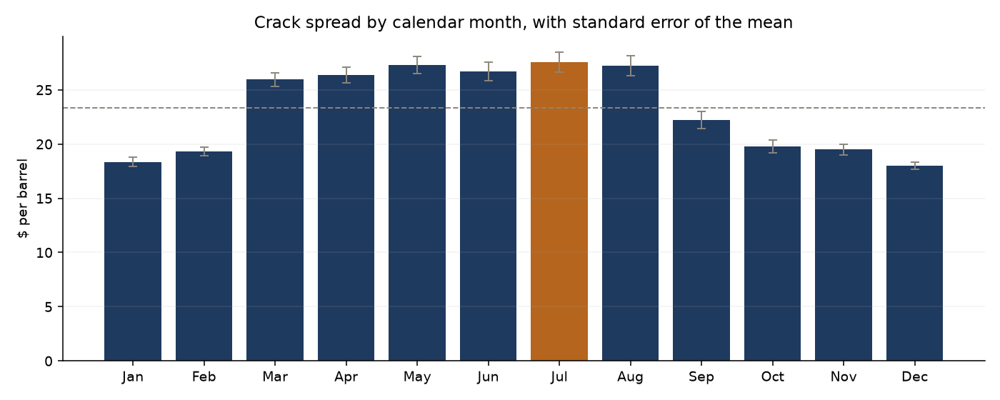

# Relative value: a spread is not a hedge

Two trades from unrelated markets, the 3-2-1 crack spread and the 2s5s10s
Treasury butterfly, both built to be neutral to something, and both carrying a
large unintended exposure to exactly that thing.

```
3-2-1 crack     beta to outright crude              -0.35
2s5s10s fly     slope loading per 1153 of curvature  -305
```

Whether the exposure can be hedged away turns out to depend on something the
textbooks skip: **the stability of the hedge ratio**. The butterfly's factor
loadings barely move, so solving for them cuts the unwanted exposure by a
factor of 53. The crack's beta to crude swings from -0.99 to +0.27, so
yesterday's ratio is a poor guide to today's and hedging removes only a third.
A hedge ratio is only as good as its own standard deviation.

Everything below is computed by `python examples/run_analysis.py` from free
data that needs no API key: front-month energy futures from Yahoo Finance,
constant maturity Treasury yields from FRED.

## Why a rolling mean is the wrong baseline

The starting point is a diagnostic, not a preference. Run an augmented
Dickey-Fuller test on the butterfly and the answer depends entirely on the
window:

| Window | n | p-value | Verdict | Mean |
|---|---:|---:|---|---:|
| 1990-2026 | 9184 | 0.002 | stationary | +2.4 bp |
| 2000-2009 | 2501 | 0.031 | stationary | — |
| 2010-2019 | 2501 | 0.120 | unit root | — |
| 2015-2026 | 2929 | 0.084 | unit root | −9.5 bp |
| 2020-2026 | 1679 | 0.249 | unit root | −19.2 bp |

The fly reverts to a level that itself moves. Over 36 years that looks like
mean reversion; over any ten-year window it looks like a random walk, and the
mean slides by 22 basis points. A z-score against a trailing mean keeps
insisting the fly is cheap while the level it reverts to walks away underneath
it.

So model the level it should be at, conditional on what is already known, and
trade the residual.

## Layer 1: conditional fair value

Fitted on a 500-day trailing window that ends the day *before* the observation
it prices. A fair value fitted on the whole sample and then "traded" is not a
model, it is a description of what already happened. There is a test for this
that does not rely on reading the code: rewrite the tail of the input and check
that no earlier coefficient moves.

The test of whether the model earned its keep is hard to fudge. The raw series
must fail a stationarity test and the residual must pass it.

**Butterfly**, 2408 out-of-sample days:

| | ADF | p | Verdict | Half-life |
|---|---:|---:|---|---:|
| Raw fly | −2.30 | 0.173 | unit root | does not revert |
| Model residual | **−3.45** | **0.009** | **stationary** | **35 days** |

Regression with Newey-West standard errors, R² = 0.462:

```
              coefficient  hac_se  t_stat
const             -29.629   4.003  -7.402
level              -1.041   0.858  -1.213
slope              25.469   1.666  15.287
realised_vol        0.131   0.040   3.290
```

Curvature is driven by the **slope**, not the level: the level coefficient is
not significant at all. "The fly is cheap given how steep the curve is" is a
research statement. "The fly is low" is not.



**Crack spread.** It is not stationary on its own but *is* cointegrated with
crude (p = 0.0015), which is the statistical version of something obvious: a
refining margin cannot drift away from the price of its own input forever. That
makes a levels specification legitimate where it would otherwise be spurious.

The model nonetheless **fails its own test**: the out-of-sample residual is
still a unit root at 5% (p = 0.20). Half-life improves from 53 to 13 days, so
something was learned, but not enough to claim a stationary residual. Reported
as such rather than quietly dropped.

The half-life function refuses to answer for a series that does not pass a
stationarity test first. Regressing the change of a random walk on its own
lagged level produces a slightly negative slope in any finite sample — the
Dickey-Fuller bias — so the naive formula returns a confident-looking half-life
for a series that never reverts.

## Layer 2: what the position is really exposed to

Dollar loading of each butterfly weighting on each principal component, per $1m
of body:

| Weighting | Level | Slope | Curvature |
|---|---:|---:|---:|
| Equal notional (1-2-1) | +0.02 | **−304.68** | +1152.65 |
| 50/50 DV01 | +28.56 | +53.75 | +535.56 |
| PCA-neutral | +0.30 | **−5.78** | +563.21 |

The received wisdom is that a 1-2-1 fly should be DV01-weighted because a basis
point on a 2y is worth less than one on a 10y. True, and insufficient. DV01
neutrality protects against a *parallel* shift; the curve's empirical level
factor loads unequally across tenors (0.543 / 0.620 / 0.567), so the
DV01-weighted fly still carries level risk, and **both** classic weightings
carry a slope exposure a quarter the size of the curvature they are meant to
trade. This is consistent with the published observation that PV01-weighted
butterflies show considerable correlation with outright rate levels.

Only solving the wing weights against the estimated loadings isolates
curvature, and even then not perfectly, because those weights are fitted on a
trailing window. Cutting slope exposure by 53× is what a hedge can deliver;
claiming zero would mean having fitted it on the data it is measured against.



The crack tells the opposite story:

```
beta to crude, raw                 -0.349
beta to crude, after a rolling hedge -0.234
hedge quality                       0.330
hedge ratio: mean -0.057, sd 0.291, range -0.99 to +0.27
signal-to-noise of the ratio        0.20
```

A "3-2-1 crack spread" position is 35% a short-crude position. Hedging removes
a third of that, and no more, because the ratio is mostly noise: its standard
deviation is five times its mean. The butterfly's weights, by contrast, have a
signal-to-noise of 6.5, which is why hedging works there and not here.

## Layer 3: which regimes the edge lives in

A single Sharpe over a decade hides the only thing a risk taker needs. Regimes
are labelled from a trailing window, never from a full-sample median, which
would use the end of the history to decide what counted as "high volatility" at
the beginning.

Butterfly signal, z-score on the model residual, 0.25bp per trade:

| Split | Regime | Days | Sharpe | Worst day |
|---|---|---:|---:|---:|
| Curve inverted | inverted | 552 | **1.26** | −8.7 |
| | normal | 1855 | 0.29 | −25.3 |
| Rate volatility | high | 720 | **0.99** | −25.3 |
| | mid | 518 | −0.23 | −8.8 |
| | low | 669 | 0.25 | −16.8 |

The spread of Sharpes across regimes is 0.96 to 1.21 depending on the split.
This is a **regime bet**, and it is described as one: the signal earns 1.26
with the curve inverted and 0.29 when it is not. Anyone showing you only the
blended number is showing you an average of two different strategies.



## Layer 4: the call today

Research that stops at a Sharpe ratio is unfinished. As of the last close:

```
residual                     -4.3 bp
z-score                      -0.29
percentile                   46%
direction                    flat, at fair value
half-life                    35 days
days to 75% convergence      71
invalidation residual        -44 bp
```

A mean-reversion signal has no natural stop, because by construction it gets
more attractive as it loses money. The invalidation level is therefore set on
the residual rather than on the P&L: beyond three standard deviations the
deviation is too large to be explained by the model's own historical errors,
which means the model has broken rather than the market being wrong.

The projection cone widens rather than narrowing to a point. Under an
Ornstein-Uhlenbeck process the expected level decays at the half-life while
uncertainty grows towards the unconditional standard deviation; drawing only
the decay would promise a precision that does not exist.

## Seasonality in the crack

Unlike most calendar effects this one has a mechanism: refineries run
maintenance in the shoulder seasons and gasoline demand peaks in summer.

July averages $27.58/bbl against $18.01 in December, a $9.56 spread. Any signal
on the raw level therefore buys every winter and sells every summer and calls
it mean reversion, which is why `deseasonalise` exists.



## What this is not

Continuous front-month futures contain roll gaps, so the crack series is right
for measuring the level, the seasonality and the exposure, and wrong for
claiming a tradeable P&L to the cent. Yields are constant-maturity par yields,
not deliverable futures, so the butterfly P&L is an approximation that ignores
the basis, financing and the cheapest-to-deliver option. DV01 uses a par-bond
approximation.

None of these strategies has been traded. They are research.

## Tests

```
python -m pytest tests/ -q
25 passed
```

Nothing is checked against a stored number produced by this code. The tests pin
it to unit algebra (42 gallons in a barrel), a closed-form duration, curves
built from known factors that PCA must recover, an Ornstein-Uhlenbeck process
with a planted 20-day half-life, a planted regime edge, and two look-ahead
checks that rewrite the future and assert the past does not move.

## Layout

```
rv/crack.py       3-2-1 spread, component cracks, seasonality
rv/butterfly.py   duration, DV01, PCA, three weighting schemes
rv/fairvalue.py   rolling OLS, Newey-West, ADF, cointegration, half-life
rv/exposure.py    rolling beta, hedge quality, ratio stability
rv/regimes.py     trailing-window regime labels, conditional performance
rv/today.py       the current call, projection cone, volatility sizing
rv/data.py        Yahoo and FRED, cached to disk
```

## Running it

```
pip install -r requirements.txt
python examples/run_analysis.py
python -m pytest tests/ -q
```

## Licence

MIT.
